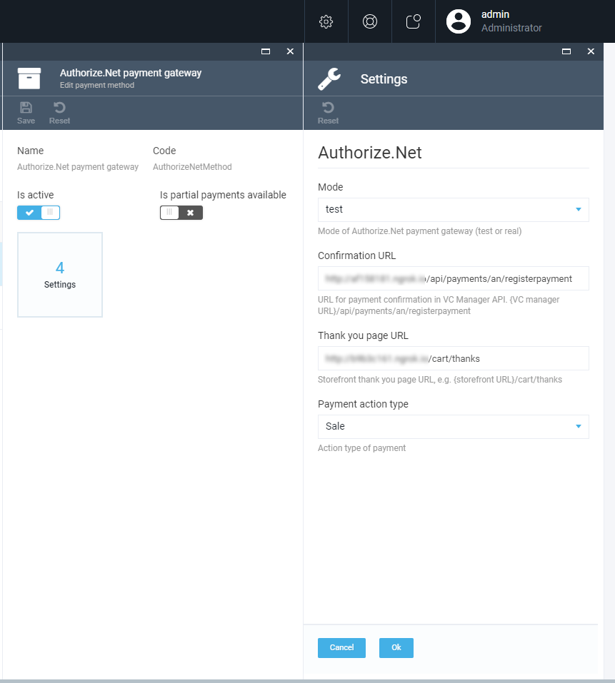

# Authorize.Net DPM payment gateway integration module
Authorize.Net Direct Post Method (DPM) payment gateway module provides integration with Authorize.Net DPM trough <a href="http://developer.authorize.net/api" target="_blank">Payment Form (SIM)</a> API.

# Installation
Installing the module:
* Automatically: in VC Manager go to Configuration -> Modules -> Authorize.Net DPM payment gateway -> Install
* Manually: download module zip package from https://github.com/VirtoCommerce/vc-module-Authorize.Net/releases. In VC Manager go to Configuration -> Modules -> Advanced -> upload module package -> Install.

# Store settings UI


# Settings
The module can be configured in the following places:
- Platfrom config file: appsettings.json
- Store-specific settings: Stores -> (your store) -> Payment methods -> Authorize.Net payment gateway -> Settings

Confidential account settings AccountNumber and LicenseKey provided by Avalara during registration process should be configured in appsetting.json:
* **API login id** - Authorize.Net API login ID from credentials
* **Transaction key** - Authorize.Net transaction key from credentials
* **SHA2 hash key** - Authorize.Net SHA2 hash key used for relay response validation. Should be created in Authorize.Net account setting "API Credentials & Keys".

```json
"Payments": {
    "AuthorizeNet": {
        "ApiLogin": "Your api login", 
        "TxnKey": "Your transaction key",
        "SHA2Hash": "You signature hash"
    }
}
```

Others nonconfidential settings should be configured at Store-specific settings - Stores -> (your store) -> Payment methods -> Authorize.Net payment gateway -> Settings:
* **Mode** - Mode of Authorize.Net payment gateway (test or real)
* **Confirmation URL** - URL for payment confirmation in VC Manager API. {VC manager URL}/api/payments/an/registerpayment. **Should be added to Authorize.Net account setting "Response/Receipt URLs"** 
* **Thank you page URL** - Storefront thank you page URL.
* **Payment action type** - Action type of payment


# License
Copyright (c) Virto Solutions LTD.  All rights reserved.

Licensed under the Virto Commerce Open Software License (the "License"); you
may not use this file except in compliance with the License. You may
obtain a copy of the License at

http://virtocommerce.com/opensourcelicense

Unless required by applicable law or agreed to in writing, software
distributed under the License is distributed on an "AS IS" BASIS,
WITHOUT WARRANTIES OR CONDITIONS OF ANY KIND, either express or
implied.
